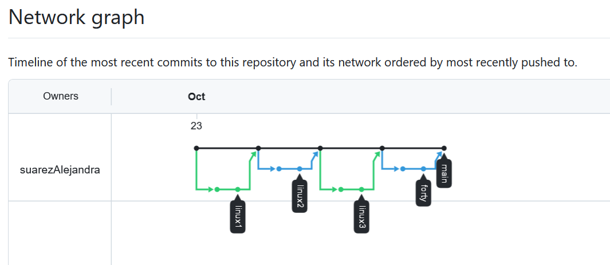

# Repositorio con ejercicios de clase
**Nombre:** Alejandra Suárez Fano

**Contenido del repositorio:**

- Ejercicios de repaso de Linux divididos en 3 bloques.
- Ejercicio forty resuelto con sus comandos.
- Archivos `.md`, imágenes y PDF asociados a cada actividad.

**URL:** https://github.com/suarezAlejandra/ejerciciosClase.git

**GRÁFICO DE GITHUB 'INSIGHTS-NETWORK: NETWORK GRAPH':**

